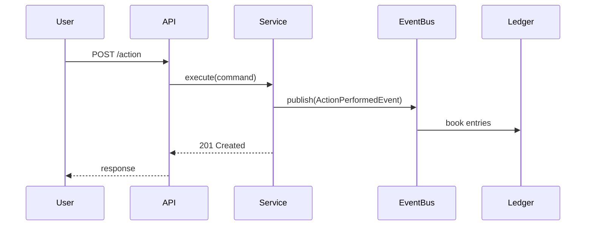

# /design — Design Loop (FDD Design by Feature)

The **Design** loop produces the technical design — the "how" — for a feature that has passed /refine. This is FDD's "Design by Feature" step: domain model updates, event flows, component design, API contracts, and NFR strategy. Design is done BEFORE test-and-develop, so Paul and Dmitri have clear guidance.

## Context Check (Before Starting)

Before starting design, verify:
- `docs/engagement/environments.md` — Target architecture and deployment topology
- `docs/engagement/codebase-patterns.md` — Full patterns (build, test, conventions, shared libs)
- `docs/engagement/test-data.md` — Data strategy (affects design of test interfaces)
- `docs/engagement/observability.md` — Monitoring tools and targets (affects instrumentation design)
- `docs/engagement/tech-debt.md` — Full debt map (design around fragile areas)
- `docs/engagement/team.md` — Architecture reviewers (who approves the design)

If ANY required context is missing → prompt User (see `/initiate` gap-fill protocol).

## Participants

| Role | Agent | Contribution |
|---|---|---|
| **Architect** | Dmitri | Component design, API contracts, event flows, data model |
| **Testability** | Paul | "How will I test this? What interfaces do I need?" |
| **Behavior** | Igor | Confirms design satisfies the refined scenarios |
| **Navigator** | User | Approves design decisions, resolves trade-offs |

## Entry Criteria

- Feature has passed /refine (Definition of Ready met)
- All spikes resolved (no open unknowns)
- `backlog/ready/<slug>/feature.md` exists with scenarios

## The Loop

```
┌─────────────────────────────────────────────────┐
│  1. Dmitri proposes domain model changes        │
│     - New/modified entities, aggregates         │
│     - Event flows (Mermaid sequence diagrams)   │
│     - API contracts (endpoints, payloads)       │
│     User: "Does this model feel right?"         │
│                                                 │
│  2. Paul reviews for testability                │
│     - "I need this interface to stub X"         │
│     - "This coupling makes testing hard"        │
│     - "Where do I inject test data?"            │
│     User: "Paul's concerns valid?"              │
│                                                 │
│  3. Igor validates against scenarios            │
│     - "Does this design satisfy scenario X?"    │
│     - "What about edge case Y?"                │
│     User: "Behavior preserved?"                 │
│                                                 │
│  4. NFR design decisions                        │
│     - Dmitri: "Here's how we meet perf target"  │
│     - Paul: "Here's how I'll verify it"         │
│     - Dmitri: "Here's the resilience strategy"  │
│     User: "Acceptable approach?"                │
│                                                 │
│  5. Test design (Paul + Dmitri co-own)          │
│     - Test isolation: shared state risks?       │
│     - Fixtures: new test data, lifecycle?       │
│     - Infrastructure: extensions, base classes? │
│     - Content negotiation / output formats?     │
│     User: "Test approach sound?"                │
│                                                 │
│  6. User approves design                        │
│     □ Approved → exit, ready for /test-and-develop│
│     □ Concerns → loop, address specific issue   │
│     □ Too complex → simplify or split feature   │
│     □ Test design incomplete → address before exit│
└─────────────────────────────────────────────────┘
```

## Design Artifacts

### Domain Model Update
```
Entities affected: [list]
New aggregates: [if any]
Relationships: [diagram]
Invariants: [business rules this design enforces]
```

### Event Flow (Mermaid)


### API Contract
```
POST /api/v1/<resource>
  Request: { field: type, ... }
  Response: { field: type, ... }
  Events: [ActionPerformedEvent]
  Errors: [400 validation, 409 conflict, 503 dependency unavailable]
```

### Component Design
```
Components:
  - <Resource>Controller — HTTP layer, validation
  - <Resource>Service — business logic, event publishing
  - <Resource>Repository — persistence
  - <Resource>EventHandler — downstream event reactions

Interfaces (for Paul's testability):
  - <Resource>Gateway (interface) — external dependency, stubbable
  - EventPublisher (interface) — event capture in tests
```

### NFR Strategy
```
Performance:
  - Approach: [caching / async / batch / index]
  - Paul verifies: [benchmark scenario from feature.md]

Security:
  - Approach: [RBAC / input validation / encryption]
  - Paul verifies: [security scenario from feature.md]

Resilience:
  - Approach: [circuit breaker / retry / fallback]
  - Paul verifies: [resilience scenario from feature.md]
```

### Test Design (Paul + Dmitri co-own)

Test architecture decisions are as load-bearing as production architecture. Non-obvious shared state (static fields, singleton config, thread-local context) causes silent cross-test pollution that is expensive to debug. Design the test strategy explicitly.

```
Isolation:
  - Shared state risks: [static globals, singletons, mutable class-level config]
  - Reset strategy: [extension, base class @BeforeEach, per-test cleanup]
  - Cross-test pollution vectors: [DB state, static config, event bus, caches]

Fixtures:
  - New test data needed: [entities, seed data, factory methods]
  - Fixture lifecycle: [per-test, per-class, shared across suite]
  - Builder/factory: [new builders needed, existing ones to extend]

Infrastructure:
  - New test utilities: [extensions, base classes, custom matchers]
  - Content negotiation: [JSON default, CSV/XML via Accept header — test both]
  - Snapshot/contract tests: [OpenAPI regeneration needed?]

Integration boundaries:
  - External dependencies to stub: [interfaces, WireMock, Testcontainers]
  - Database: [schema changes, new tables, migration needed?]
  - Event verification: [capture published events, assert contents]
```

## Outputs

```
backlog/ready/<feature-slug>/
  design.md               — Technical design document
  event-flow.md           — Mermaid sequence diagrams
  api-contract.md         — Endpoint specifications
  component-diagram.md    — Component structure + interfaces
  nfr-strategy.md         — How NFR targets will be met + tested
  test-design.md          — Test isolation, fixtures, infrastructure, integration boundaries
```

## Invocation

```bash
/design                        — Design the top refined (ready) item
/design <feature-slug>         — Design a specific refined feature
/design --review               — Review an existing design (e.g., after spike results)
```
